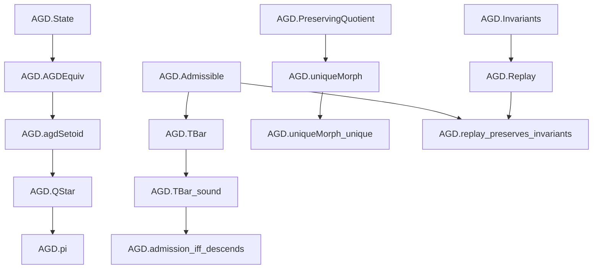

# PROOF_GRAPH.md

## AGD Proof Dependency Graph

---

## Verified Core Theorems Summary

1. **`AGDEquiv.refl`, `symm`, `trans`**: Establishes equivalence relation properties for $\Omega$ and $C$.
2. **`agdSetoid`**: Constructs Lean setoid over operational states.
3. **`QStar` & `pi`**: Defines canonical minimal quotient space and projection map.
4. **`TBar` & `TBar_sound`**: Proves sound descendability of admissible operators onto $Q^*$.
5. **`uniqueMorph` & `uniqueMorph_unique`**: Formalizes initiality and universal property of $Q^*$.
6. **`interchangeable_iff`**: Establishes quotient equivalence characterization.
7. **`admission_iff_descends`**: Proves operator admissibility iff descended map acts as identity on $Q^*$.
8. **`replay_preserves_invariants`**: Inductive proof that sequential admissible operator replay preserves state invariants across arbitrarily long traces.
