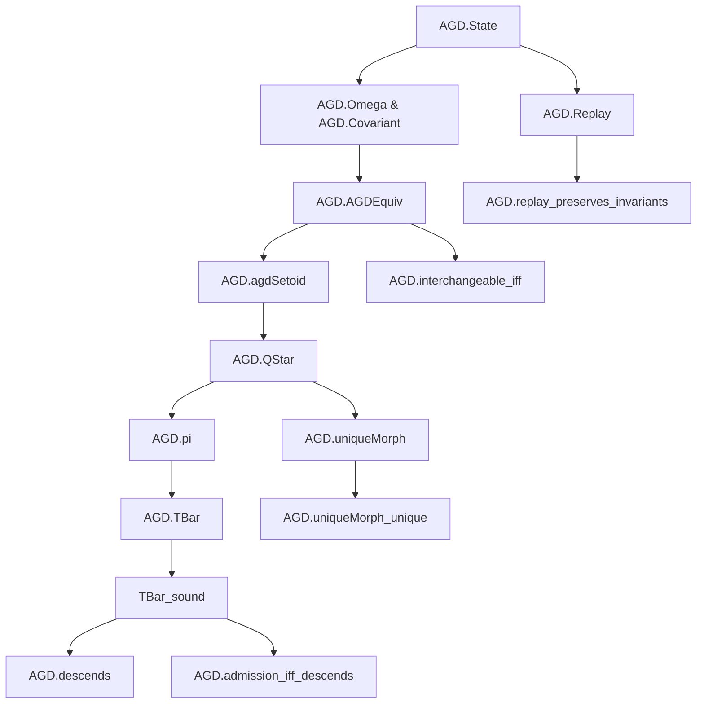

# PROOF_GRAPH

## Formal Dependency Hierarchy

1. **Core State & Invariants**: `AGD.State`, `AGD.Omega`, `AGD.Covariant`, `AGD.Operator`
2. **Equivalence & Quotient Layer**: `AGD.AGDEquiv` $\to$ `AGD.agdSetoid` $\to$ `AGD.QStar` $\to$ `AGD.pi`
3. **Morphism & Initiality**: `AGD.PreservingQuotient` $\to$ `AGD.uniqueMorph` $\to$ `AGD.uniqueMorph_unique`
4. **Metamodel & Replay**: `AGD.Replay`, `AGD.Witness`, `AGD.Invariants` $\to$ `AGD.replay_preserves_invariants`
